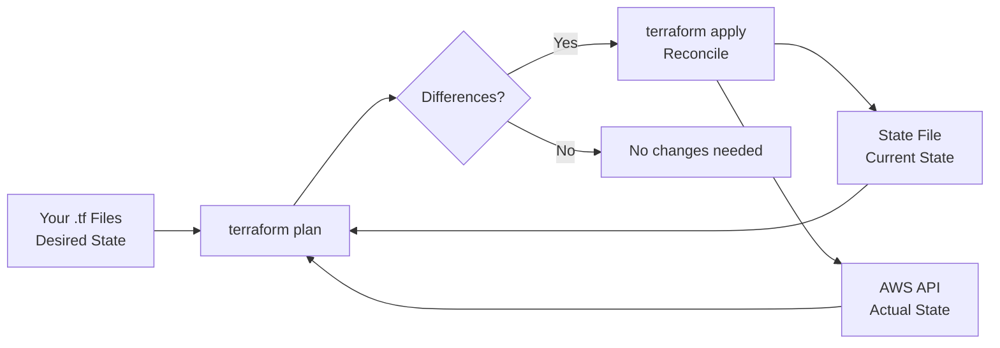
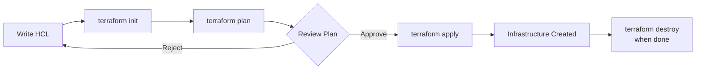

## Why Java Developers Need Terraform

You write the application code. But your application doesn't run in a vacuum — it needs databases, load balancers, DNS records, queues, and container orchestration. If you're still creating these resources by clicking through the AWS console, you have a problem:

- **No reproducibility** — Can you recreate your environment from scratch?
- **No history** — Who changed what, when?
- **No review** — Infrastructure changes bypass code review.
- **No testing** — You can't test a click.

Terraform lets you define infrastructure in code, version it in Git, review it in PRs, and apply it reproducibly. As a Java developer, you already think in types, modules, and composition — Terraform maps cleanly to those mental models.

---

## Java Concepts → Terraform Concepts

| Java Concept | Terraform Equivalent | Example |
|--------------|---------------------|---------|
| Class | Resource | `resource "aws_s3_bucket" "data"` |
| Interface | Module (input contract) | `module "vpc" { source = "./modules/vpc" }` |
| Constructor params | Variables | `variable "instance_type" { default = "t3.micro" }` |
| Getters / return values | Outputs | `output "bucket_arn" { value = aws_s3_bucket.data.arn }` |
| Package | Module directory | `modules/database/` |
| Dependency injection | Resource references | `subnet_id = aws_subnet.main.id` |
| `new Object()` | Resource block | Creates the real infrastructure |
| `.toString()` | `terraform output` | Inspect created resources |
| Unit test | `terraform plan` | Preview what will change |
| `mvn deploy` | `terraform apply` | Create/update real resources |

---

## Setup

### Install Terraform

```bash
# macOS
brew install terraform

# Verify
terraform --version
# Terraform v1.9.x
```

### Project Structure

```
infrastructure/
├── main.tf          # Primary resources
├── variables.tf     # Input variables
├── outputs.tf       # Output values
├── providers.tf     # Provider configuration
├── terraform.tfvars # Variable values (git-ignored for secrets)
└── modules/
    ├── database/
    │   ├── main.tf
    │   ├── variables.tf
    │   └── outputs.tf
    └── ecs/
        ├── main.tf
        ├── variables.tf
        └── outputs.tf
```

### Provider Configuration

```hcl
# providers.tf
terraform {
  required_version = ">= 1.9.0"

  required_providers {
    aws = {
      source  = "hashicorp/aws"
      version = "~> 5.60"
    }
  }

  backend "s3" {
    bucket = "my-terraform-state"
    key    = "prod/terraform.tfstate"
    region = "us-east-1"
  }
}

provider "aws" {
  region = var.aws_region

  default_tags {
    tags = {
      Environment = var.environment
      ManagedBy   = "terraform"
      Project     = var.project_name
    }
  }
}
```

---

## First Resource — AWS S3 Bucket

Think of this as `new S3Bucket(config)`:

```hcl
# main.tf
resource "aws_s3_bucket" "app_uploads" {
  bucket = "${var.project_name}-uploads-${var.environment}"
}

resource "aws_s3_bucket_versioning" "app_uploads" {
  bucket = aws_s3_bucket.app_uploads.id
  versioning_configuration {
    status = "Enabled"
  }
}

resource "aws_s3_bucket_server_side_encryption_configuration" "app_uploads" {
  bucket = aws_s3_bucket.app_uploads.id
  rule {
    apply_server_side_encryption_by_default {
      sse_algorithm = "AES256"
    }
  }
}

resource "aws_s3_bucket_public_access_block" "app_uploads" {
  bucket = aws_s3_bucket.app_uploads.id

  block_public_acls       = true
  block_public_policy     = true
  ignore_public_acls      = true
  restrict_public_buckets = true
}
```

```bash
# Initialize (downloads provider plugins — like mvn dependency:resolve)
terraform init

# Plan (dry-run — like mvn compile without deploy)
terraform plan

# Apply (create the resources)
terraform apply
```

---

## Provisioning What Your Spring Boot App Needs

A typical Spring Boot application needs: a database, a security group, and a place to run. Let's provision all three.

### RDS PostgreSQL

```hcl
resource "aws_db_instance" "main" {
  identifier = "${var.project_name}-db-${var.environment}"

  engine         = "postgres"
  engine_version = "16.3"
  instance_class = var.db_instance_class

  allocated_storage     = 20
  max_allocated_storage = 100
  storage_encrypted     = true

  db_name  = var.db_name
  username = var.db_username
  password = var.db_password

  vpc_security_group_ids = [aws_security_group.database.id]
  db_subnet_group_name   = aws_db_subnet_group.main.name

  backup_retention_period = 7
  multi_az               = var.environment == "prod" ? true : false
  skip_final_snapshot    = var.environment != "prod"

  tags = {
    Name = "${var.project_name}-database"
  }
}
```

### Security Group

```hcl
resource "aws_security_group" "database" {
  name_prefix = "${var.project_name}-db-"
  vpc_id      = var.vpc_id

  ingress {
    from_port       = 5432
    to_port         = 5432
    protocol        = "tcp"
    security_groups = [aws_security_group.application.id]
    description     = "PostgreSQL from application"
  }

  egress {
    from_port   = 0
    to_port     = 0
    protocol    = "-1"
    cidr_blocks = ["0.0.0.0/0"]
  }

  lifecycle {
    create_before_destroy = true
  }
}
```

### ECS Fargate Service

```hcl
resource "aws_ecs_task_definition" "app" {
  family                   = "${var.project_name}-${var.environment}"
  requires_compatibilities = ["FARGATE"]
  network_mode            = "awsvpc"
  cpu                     = 512
  memory                  = 1024
  execution_role_arn      = aws_iam_role.ecs_execution.arn
  task_role_arn           = aws_iam_role.ecs_task.arn

  container_definitions = jsonencode([{
    name  = "app"
    image = "${var.ecr_repository_url}:${var.app_version}"
    portMappings = [{
      containerPort = 8080
      protocol      = "tcp"
    }]
    environment = [
      { name = "SPRING_PROFILES_ACTIVE", value = var.environment },
      { name = "SERVER_PORT", value = "8080" }
    ]
    secrets = [
      { name = "SPRING_DATASOURCE_URL", valueFrom = aws_ssm_parameter.db_url.arn },
      { name = "SPRING_DATASOURCE_PASSWORD", valueFrom = aws_ssm_parameter.db_password.arn }
    ]
    logConfiguration = {
      logDriver = "awslogs"
      options = {
        "awslogs-group"         = aws_cloudwatch_log_group.app.name
        "awslogs-region"        = var.aws_region
        "awslogs-stream-prefix" = "app"
      }
    }
    healthCheck = {
      command     = ["CMD-SHELL", "curl -f http://localhost:8080/actuator/health || exit 1"]
      interval    = 30
      timeout     = 5
      retries     = 3
      startPeriod = 60
    }
  }])
}

resource "aws_ecs_service" "app" {
  name            = "${var.project_name}-${var.environment}"
  cluster         = aws_ecs_cluster.main.id
  task_definition = aws_ecs_task_definition.app.arn
  desired_count   = var.desired_count
  launch_type     = "FARGATE"

  network_configuration {
    subnets         = var.private_subnet_ids
    security_groups = [aws_security_group.application.id]
  }

  load_balancer {
    target_group_arn = aws_lb_target_group.app.arn
    container_name   = "app"
    container_port   = 8080
  }
}
```

---

## State — Like a Database for Your Infra

Terraform state tracks what resources exist and their current configuration. Think of it as a database that maps your HCL code to real AWS resources.




**Critical rules:**
- **Never** edit state manually.
- Store state remotely (S3 + DynamoDB for locking).
- Enable versioning on the state bucket.
- One state file per environment.

```hcl
# Remote state configuration
terraform {
  backend "s3" {
    bucket         = "mycompany-terraform-state"
    key            = "services/bookstore/prod/terraform.tfstate"
    region         = "us-east-1"
    dynamodb_table = "terraform-locks"
    encrypt        = true
  }
}
```

---

## Modules = Reusable Libraries

Modules in Terraform are like Java libraries — encapsulated, parameterized, reusable.

### Creating a Module

```hcl
# modules/database/variables.tf
variable "project_name" { type = string }
variable "environment" { type = string }
variable "instance_class" { type = string; default = "db.t3.micro" }
variable "vpc_id" { type = string }
variable "subnet_ids" { type = list(string) }
variable "app_security_group_id" { type = string }

# modules/database/main.tf
resource "aws_db_subnet_group" "this" {
  name       = "${var.project_name}-${var.environment}"
  subnet_ids = var.subnet_ids
}

resource "aws_db_instance" "this" {
  identifier     = "${var.project_name}-${var.environment}"
  engine         = "postgres"
  engine_version = "16.3"
  instance_class = var.instance_class
  # ... full configuration
}

# modules/database/outputs.tf
output "endpoint" { value = aws_db_instance.this.endpoint }
output "port" { value = aws_db_instance.this.port }
output "database_name" { value = aws_db_instance.this.db_name }
```

### Using the Module

```hcl
# main.tf — like calling new Database(config)
module "database" {
  source = "./modules/database"

  project_name          = var.project_name
  environment           = var.environment
  instance_class        = "db.t3.small"
  vpc_id                = module.networking.vpc_id
  subnet_ids            = module.networking.private_subnet_ids
  app_security_group_id = module.ecs.security_group_id
}

# Reference outputs — like calling getters
resource "aws_ssm_parameter" "db_url" {
  name  = "/${var.project_name}/${var.environment}/db-url"
  type  = "SecureString"
  value = "jdbc:postgresql://${module.database.endpoint}/${module.database.database_name}"
}
```

---

## Variables and Outputs

### Variables (constructor params)

```hcl
# variables.tf
variable "project_name" {
  type        = string
  description = "Name of the project"
}

variable "environment" {
  type        = string
  description = "Deployment environment"
  validation {
    condition     = contains(["dev", "staging", "prod"], var.environment)
    error_message = "Environment must be dev, staging, or prod."
  }
}

variable "desired_count" {
  type        = number
  description = "Number of ECS tasks"
  default     = 2
}

variable "enable_monitoring" {
  type        = bool
  description = "Enable CloudWatch alarms"
  default     = true
}
```

### Outputs (return values)

```hcl
# outputs.tf
output "api_url" {
  value       = "https://${aws_lb.main.dns_name}"
  description = "URL of the load balancer"
}

output "database_endpoint" {
  value       = module.database.endpoint
  description = "RDS endpoint"
  sensitive   = true
}
```

---

## Terraform Workflow




| Command | Java Equivalent | Purpose |
|---------|----------------|---------|
| `terraform init` | `mvn dependency:resolve` | Download providers/modules |
| `terraform plan` | `mvn compile` (dry-run) | Show what will change |
| `terraform apply` | `mvn deploy` | Create/update resources |
| `terraform destroy` | N/A | Delete all managed resources |
| `terraform fmt` | Code formatter | Format HCL files |
| `terraform validate` | Compiler check | Check syntax and types |

---

## Integrating with GitHub Actions

```yaml
# .github/workflows/terraform.yml
name: Terraform
on:
  push:
    branches: [main]
    paths: ['infrastructure/**']
  pull_request:
    paths: ['infrastructure/**']

jobs:
  terraform:
    runs-on: ubuntu-latest
    defaults:
      run:
        working-directory: infrastructure

    steps:
      - uses: actions/checkout@v4

      - uses: hashicorp/setup-terraform@v3
        with:
          terraform_version: 1.9.0

      - name: Terraform Init
        run: terraform init

      - name: Terraform Format Check
        run: terraform fmt -check

      - name: Terraform Plan
        run: terraform plan -out=tfplan
        env:
          AWS_ACCESS_KEY_ID: ${{ secrets.AWS_ACCESS_KEY_ID }}
          AWS_SECRET_ACCESS_KEY: ${{ secrets.AWS_SECRET_ACCESS_KEY }}

      - name: Terraform Apply
        if: github.ref == 'refs/heads/main' && github.event_name == 'push'
        run: terraform apply -auto-approve tfplan
        env:
          AWS_ACCESS_KEY_ID: ${{ secrets.AWS_ACCESS_KEY_ID }}
          AWS_SECRET_ACCESS_KEY: ${{ secrets.AWS_SECRET_ACCESS_KEY }}
```

---

## Common Problems

| Problem | Cause | Solution |
|---------|-------|----------|
| "Resource already exists" | Resource created outside Terraform | `terraform import aws_s3_bucket.x bucket-name` |
| State lock stuck | Crashed apply, CI timeout | `terraform force-unlock LOCK_ID` |
| Cyclic dependency | Resources reference each other | Break cycle with `depends_on` or restructure |
| Drift detected | Manual console changes | Run `terraform plan` regularly, enforce no-console policy |
| Secrets in state | Passwords stored in plain text | Use `sensitive = true`, encrypt state backend |
| Slow plan | Too many resources in one state | Split into smaller states (per-service) |
| Provider version conflict | Multiple modules need different versions | Pin versions, use `required_providers` |

---

## References

- [Terraform Documentation](https://developer.hashicorp.com/terraform/docs)
- [AWS Provider Documentation](https://registry.terraform.io/providers/hashicorp/aws/latest/docs)
- [Terraform Best Practices](https://www.terraform-best-practices.com/)
- [Terraform Up & Running — Yevgeniy Brikman](https://www.terraformupandrunning.com/)
- [Learn Terraform — HashiCorp](https://developer.hashicorp.com/terraform/tutorials)
