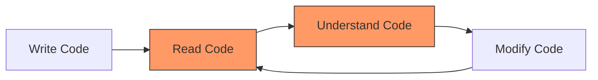
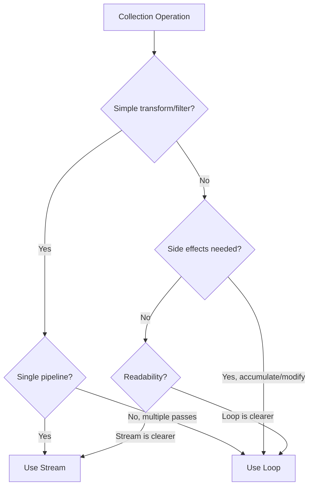

## Why This Matters

Clean code isn't about aesthetics — it's about **maintenance cost**. Code is read 10x more than it's written. Every shortcut you take today becomes a tax on every developer who touches that code later, including future you.

Java in 2026 gives us tools that make clean code **easier** to write. Records, pattern matching, sealed classes, and improved APIs mean we can express intent more directly. This post covers practical patterns — not theory.




The red boxes are where you spend most of your time. Clean code optimizes for reading and understanding.

---

## var — When It Helps (and When It Hurts)

`var` (local variable type inference) reduces boilerplate when the type is obvious. It does **not** mean "untyped."

### When var Helps

```java
// BEFORE: Redundant — type appears twice
Map<String, List<CustomerOrder>> ordersByCustomer = new HashMap<String, List<CustomerOrder>>();
CustomerRegistrationService service = new CustomerRegistrationService();

// AFTER: Type is obvious from the right side
var ordersByCustomer = new HashMap<String, List<CustomerOrder>>();
var service = new CustomerRegistrationService();
```

```java
// In loops — type is clear from context
for (var entry : ordersByCustomer.entrySet()) {
    var customer = entry.getKey();
    var orders = entry.getValue();
}

// With try-with-resources
try (var reader = new BufferedReader(new FileReader(path))) {
    var firstLine = reader.readLine();
}
```

### When var Hurts

```java
// BAD: What type does this return?
var result = service.process(input);
var data = repository.find(criteria);
var x = calculate(a, b, c);

// GOOD: Keep the type when it's not obvious
ProcessingResult result = service.process(input);
Optional<Customer> data = repository.find(criteria);
BigDecimal x = calculate(a, b, c);
```

### The Rule

> Use `var` when the type is obvious from the **right side of the assignment** or from the **variable name**. If a reader would need to hover/navigate to understand the type, spell it out.

---

## Records Everywhere

Records should be your **default** for data carriers. Stop writing classes with 50 lines of boilerplate for what is essentially a tuple.

### DTOs

```java
// BEFORE: 45 lines of boilerplate
public class CustomerDto {
    private final Long id;
    private final String name;
    private final String email;
    // constructor, getters, equals, hashCode, toString...
}

// AFTER: 1 line
public record CustomerDto(Long id, String name, String email) {}
```

### Value Objects

```java
public record Money(BigDecimal amount, Currency currency) {
    public Money {
        Objects.requireNonNull(amount, "amount must not be null");
        Objects.requireNonNull(currency, "currency must not be null");
        if (amount.scale() > currency.getDefaultFractionDigits()) {
            throw new IllegalArgumentException("Too many decimal places");
        }
    }

    public Money add(Money other) {
        if (!this.currency.equals(other.currency)) {
            throw new IllegalArgumentException("Cannot add different currencies");
        }
        return new Money(this.amount.add(other.amount), this.currency);
    }
}
```

### Method Returns (replace Pair/Tuple)

```java
// BEFORE: What does Pair<String, Integer> even mean?
public Pair<String, Integer> processOrder(Order order) { ... }

// AFTER: Self-documenting
public record OrderResult(String confirmationId, int estimatedDays) {}

public OrderResult processOrder(Order order) { ... }
```

---

## Optional Done Right

Optional is the most misused feature in Java. Here are the 5 rules:

### The 5 Rules of Optional

| Rule | Do | Don't |
|------|-----|-------|
| 1. Return type only | `Optional<User> findById(Long id)` | `void process(Optional<User> user)` |
| 2. Never null | Always return `Optional.empty()` | Never return `null` from an Optional method |
| 3. Don't use for fields | Use nullable fields internally | `private Optional<String> middleName` |
| 4. Don't use in collections | `List<User>` (empty list = no results) | `Optional<List<User>>` |
| 5. Chain, don't unwrap | Use `map`, `flatMap`, `orElseThrow` | Don't `if (opt.isPresent()) opt.get()` |

### Before/After

```java
// BAD: Treating Optional like a null check
Optional<User> maybeUser = userRepository.findById(id);
if (maybeUser.isPresent()) {
    User user = maybeUser.get();
    return user.getEmail();
}
return "unknown";

// GOOD: Fluent chain
return userRepository.findById(id)
        .map(User::getEmail)
        .orElse("unknown");
```

```java
// BAD: Optional for parameters
public void sendEmail(Optional<String> cc) { ... }

// GOOD: Overloaded methods or @Nullable
public void sendEmail() { sendEmail(null); }
public void sendEmail(@Nullable String cc) { ... }
```

```java
// GOOD: Flat-mapping nested Optionals
Optional<String> city = userRepository.findById(id)
        .map(User::getAddress)       // Optional<Address>
        .map(Address::getCity);      // Optional<String>

// GOOD: orElseThrow with meaningful exception
User user = userRepository.findById(id)
        .orElseThrow(() -> new UserNotFoundException(id));
```

---

## Streams vs Loops

Streams aren't always better. Here's a decision framework:




### Use Streams When

```java
// Filtering + transforming — natural pipeline
var activeEmails = users.stream()
        .filter(User::isActive)
        .map(User::getEmail)
        .sorted()
        .toList();

// Grouping/collecting — expressive
var byDepartment = employees.stream()
        .collect(Collectors.groupingBy(Employee::department));

// Reducing — clean aggregation
var totalSalary = employees.stream()
        .map(Employee::salary)
        .reduce(BigDecimal.ZERO, BigDecimal::add);
```

### Use Loops When

```java
// Multiple side effects per iteration
for (var order : pendingOrders) {
    order.markProcessing();
    emailService.send(order.customerEmail(), "Processing...");
    auditLog.record(order.id(), "PROCESSING");
    metrics.increment("orders.processed");
}

// Complex control flow (break, continue, early return)
for (var candidate : candidates) {
    if (candidate.isDisqualified()) continue;
    var score = evaluate(candidate);
    if (score > threshold) {
        return candidate; // early return
    }
}

// Index-dependent logic
for (int i = 0; i < items.size(); i++) {
    if (i > 0 && items.get(i).equals(items.get(i - 1))) {
        duplicates.add(items.get(i));
    }
}
```

### The Readability Threshold

If your stream pipeline exceeds **3 operations**, extract intermediate steps or use a loop:

```java
// TOO LONG: Hard to read
var result = orders.stream()
        .filter(o -> o.getStatus() == COMPLETED)
        .filter(o -> o.getDate().isAfter(cutoff))
        .map(Order::getLineItems)
        .flatMap(Collection::stream)
        .filter(li -> li.getCategory() == ELECTRONICS)
        .map(LineItem::getPrice)
        .reduce(BigDecimal.ZERO, BigDecimal::add);

// BETTER: Name intermediate steps
var completedAfterCutoff = orders.stream()
        .filter(o -> o.getStatus() == COMPLETED)
        .filter(o -> o.getDate().isAfter(cutoff))
        .toList();

var electronicsTotal = completedAfterCutoff.stream()
        .flatMap(o -> o.getLineItems().stream())
        .filter(li -> li.getCategory() == ELECTRONICS)
        .map(LineItem::getPrice)
        .reduce(BigDecimal.ZERO, BigDecimal::add);
```

---

## Immutability by Default

Mutable state is the #1 source of bugs in concurrent code. Default to immutable.

### Unmodifiable Collections

```java
// Creating immutable collections
var names = List.of("Alice", "Bob", "Charlie");    // immutable
var scores = Map.of("Alice", 95, "Bob", 87);       // immutable
var tags = Set.of("java", "spring", "docker");     // immutable

// From a mutable source — copy to immutable
var result = mutableList.stream()
        .filter(predicate)
        .collect(Collectors.toUnmodifiableList());

// Or using toList() (already unmodifiable in Java 16+)
var result = mutableList.stream()
        .filter(predicate)
        .toList();
```

### final by Habit

```java
// Make parameters and local variables final (or effectively final)
public OrderResult process(final Order order) {
    final var customer = customerRepository.findById(order.customerId())
            .orElseThrow(() -> new CustomerNotFoundException(order.customerId()));

    final var discount = calculateDiscount(customer);
    final var total = order.subtotal().subtract(discount);

    return new OrderResult(order.id(), total, Instant.now());
}
```

### Immutable Domain Objects

```java
// Use records for immutable state
public record Address(String street, String city, String zip, String country) {
    // "modification" returns a new instance
    public Address withCity(String newCity) {
        return new Address(street, newCity, zip, country);
    }
}
```

---

## Null Handling Strategy

| Approach | When to Use | Example |
|----------|-------------|---------|
| `Optional` return type | Public API methods that may not find a result | `Optional<User> findById(Long id)` |
| `@Nullable` annotation | Internal code, framework integration | `@Nullable String middleName` |
| Null Object pattern | When you need a no-op implementation | `Notification.NONE` |
| Default values | Configuration, user preferences | `config.getOrDefault("timeout", 30)` |
| Early validation | Method entry points | `Objects.requireNonNull(param, "msg")` |
| Empty collections | Instead of returning null lists | `return Collections.emptyList()` |

```java
// Pattern: Validate at the boundary, trust internally
public class OrderService {

    public OrderResult createOrder(CreateOrderRequest request) {
        // Validate at entry — fail fast
        Objects.requireNonNull(request, "request must not be null");
        Objects.requireNonNull(request.customerId(), "customerId required");

        if (request.items().isEmpty()) {
            throw new IllegalArgumentException("Order must have at least one item");
        }

        // Internal code can trust non-null values
        return processValidOrder(request);
    }
}
```

---

## Modern Switch (Eliminate if-else Chains)

```java
// BEFORE: if-else chain (hard to read, easy to miss a case)
public BigDecimal calculateShipping(Order order) {
    if (order.type() == OrderType.DIGITAL) {
        return BigDecimal.ZERO;
    } else if (order.type() == OrderType.STANDARD) {
        return new BigDecimal("5.99");
    } else if (order.type() == OrderType.EXPRESS) {
        return new BigDecimal("14.99");
    } else if (order.type() == OrderType.SAME_DAY) {
        return new BigDecimal("24.99");
    } else {
        throw new IllegalArgumentException("Unknown type: " + order.type());
    }
}

// AFTER: Switch expression (exhaustive, clean)
public BigDecimal calculateShipping(Order order) {
    return switch (order.type()) {
        case DIGITAL  -> BigDecimal.ZERO;
        case STANDARD -> new BigDecimal("5.99");
        case EXPRESS  -> new BigDecimal("14.99");
        case SAME_DAY -> new BigDecimal("24.99");
    };
}
```

---

## Exception Handling Patterns

### Custom Exception Hierarchy

```java
// Base exception for your domain
public sealed class OrderException extends RuntimeException
    permits OrderNotFoundException, OrderValidationException, OrderProcessingException {

    private final String orderId;

    protected OrderException(String orderId, String message) {
        super(message);
        this.orderId = orderId;
    }

    public String getOrderId() { return orderId; }
}

public final class OrderNotFoundException extends OrderException {
    public OrderNotFoundException(String orderId) {
        super(orderId, "Order not found: " + orderId);
    }
}

public final class OrderValidationException extends OrderException {
    private final List<String> violations;

    public OrderValidationException(String orderId, List<String> violations) {
        super(orderId, "Validation failed for order " + orderId);
        this.violations = List.copyOf(violations);
    }
}

public final class OrderProcessingException extends OrderException {
    public OrderProcessingException(String orderId, Throwable cause) {
        super(orderId, "Processing failed for order " + orderId);
        initCause(cause);
    }
}
```

### Pattern: Exception Mapping with switch

```java
@ExceptionHandler(OrderException.class)
public ResponseEntity<ErrorResponse> handleOrderException(OrderException ex) {
    var response = switch (ex) {
        case OrderNotFoundException e ->
            new ErrorResponse(404, e.getMessage());
        case OrderValidationException e ->
            new ErrorResponse(400, e.getMessage(), e.getViolations());
        case OrderProcessingException e ->
            new ErrorResponse(500, "Internal processing error");
    };
    return ResponseEntity.status(response.status()).body(response);
}
```

---

## Code Smells to Kill in 2026

| Smell | Example | Fix |
|-------|---------|-----|
| Primitive obsession | `String email`, `int age` | Value objects: `Email`, `Age` record |
| Boolean params | `process(order, true, false)` | Enums or parameter objects |
| Null returns | `return null` | `Optional`, empty collection, or throw |
| Raw types | `List items` | `List<OrderItem> items` |
| String typing | `status = "ACTIVE"` | `enum Status { ACTIVE, ... }` |
| God class | `OrderManager` (500+ lines) | Split by responsibility |
| Deep nesting | 4+ levels of if/for | Early returns, extract methods |
| Comment-as-code | `// check if user is active` before `if(user.isActive())` | Delete obvious comments |
| Mutable DTO | Setters on data carriers | Records |
| Checked exceptions everywhere | `throws IOException` on business methods | Wrap in domain exceptions |
| Magic numbers | `if (retries > 3)` | `private static final int MAX_RETRIES = 3` |
| Temporal coupling | Must call `init()` before `process()` | Constructor does initialization |

---

## References

- [Effective Java, 3rd Edition — Joshua Bloch](https://www.oreilly.com/library/view/effective-java/9780134686097/)
- [Clean Code — Robert C. Martin](https://www.oreilly.com/library/view/clean-code/9780136083238/)
- [Java Language Updates — Oracle](https://docs.oracle.com/en/java/javase/21/language/index.html)
- [Google Java Style Guide](https://google.github.io/styleguide/javaguide.html)
- [Error Prone — Static Analysis](https://errorprone.info/)
